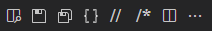

# vscodemenubar README

A sort of toolbar for Visual Studio Code.
<br />
It's base on [JerryGoyal project](https://github.com/JerryGoyal/Shortcut-Menu-Bar-VSCode-Extension), thanks Jerry!

## Features

Show buttons like beautify, save, toggle comment, toggle terminal etc to the editor menu bar in the Visual Studio Code.

For example:



## Requirements

If you have any requirements or dependencies, add a section describing those and how to install and configure them.

## Extension Settings

Include if your extension adds any VS Code settings through the `contributes.configuration` extension point.

For example:

This extension contributes the following settings:

* `myExtension.enable`: enable/disable this extension
* `myExtension.thing`: set to `blah` to do something

> Build / Compile
> * `npm run compile`
> * `vsce package`
> * `code --install-extension somemenubar-0.0.1.vsix`
---
<br/>

## Known Issues

Calling out known issues can help limit users opening duplicate issues against your extension.

## Release Notes

### 0.0.7
add Save All button

### 0.0.3
rename in code

### 0.0.2
remove item from menu bar

### 0.0.1

Initial release of someMenuBar

---
<br/>

## Following extension guidelines

Ensure that you've read through the extensions guidelines and follow the best practices for creating your extension.

* [Extension Guidelines](https://code.visualstudio.com/api/references/extension-guidelines)

## Working with Markdown

**Note:** You can author your README using Visual Studio Code.  Here are some useful editor keyboard shortcuts:

* Split the editor (`Cmd+\` on macOS or `Ctrl+\` on Windows and Linux)
* Toggle preview (`Shift+CMD+V` on macOS or `Shift+Ctrl+V` on Windows and Linux)
* Press `Ctrl+Space` (Windows, Linux) or `Cmd+Space` (macOS) to see a list of Markdown snippets

### For more information

* [Visual Studio Code's Markdown Support](http://code.visualstudio.com/docs/languages/markdown)
* [Markdown Syntax Reference](https://help.github.com/articles/markdown-basics/)

**Enjoy!**

      {
        "command": "extension.beautify",
        "title": "Beautify",
        "category": "menubar",
        "icon": {
          "light": "images/format_light.svg",
          "dark": "images/format.svg"
        }
      },
			"$(bracket)"

      {
        "command": "extension.toggleTerminal",
        "title": "Toggle terminal",
        "category": "menubar",
        "icon": {
          "light": "images/terminal_light.svg",
          "dark": "images/terminal.svg"
        }
      }
terminal-powershell


npm install -g @vscode/vsce

```xml
<svg
	version="1.1"
	xmlns="http://www.w3.org/2000/svg"
	xmlns:xlink="http://www.w3.org/1999/xlink"
	preserveAspectRatio="xMidYMid meet"
	viewBox="0 0 29 47"
	width="16" height="16"
>
	<defs>
		<text
			id="a2uHlClFNS"
			font-size="36"
			font-weight="600"
			dominant-baseline="text-before-edge"
		>
			<tspan text-anchor="start">//</tspan>
		</text>
	</defs>
	<g id="a2xIN2qkU">
		<use xlink:href="#a2uHlClFNS" opacity="1" fill="#8c8c8c" fill-opacity="1"></use>
	</g>
</svg>
```


			data-original="#000000"
			data-old_color="#0F00FF"
			style="fill:#424242"


			
			data-original="#000000"
			data-old_color="#0F00FF"
			style="fill:#424242"


			class="active-path"
			data-original="#000000"
			data-old_color="#0F00FF"
			style="fill:#e5e5e5"
			
			class="active-path"
			data-original="#000000"
			data-old_color="#0F00FF"
			style="fill:#e5e5e5"
